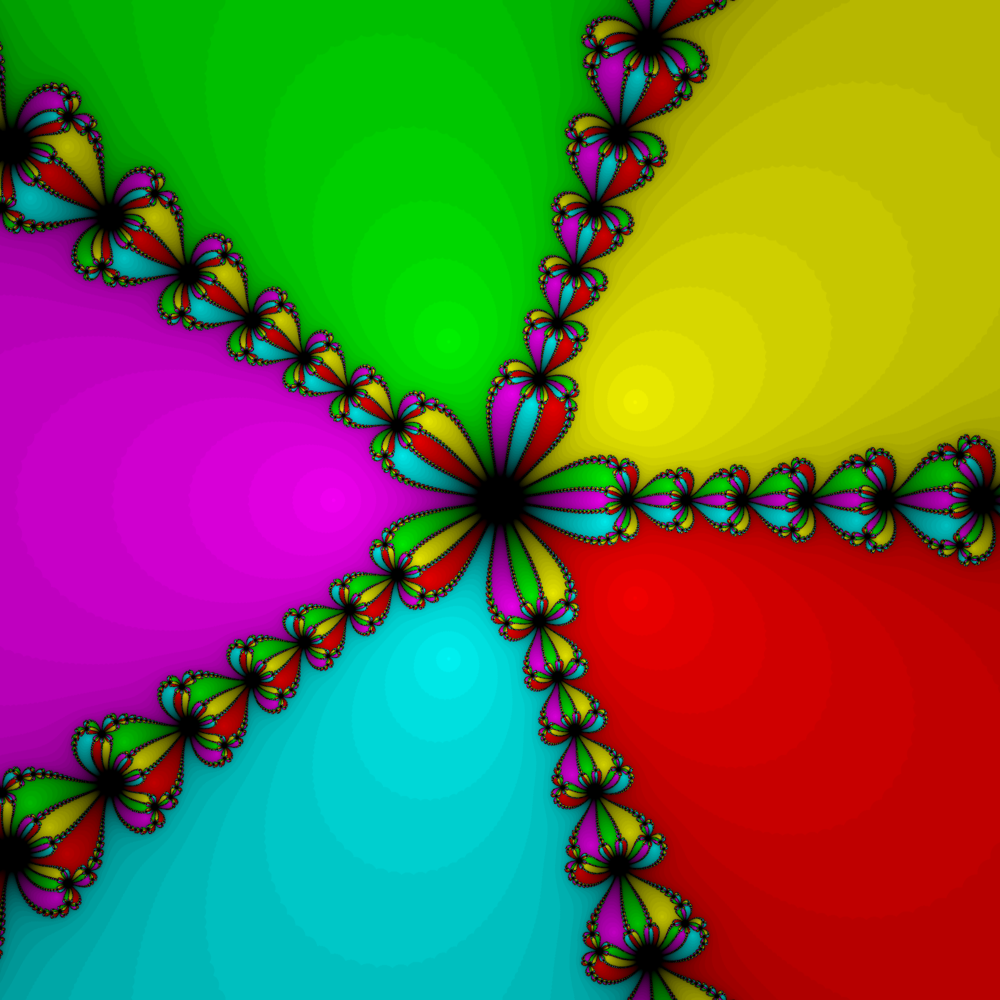

# Basins of attraction

>Zgodnie z procedurą opisaną w książce Kincaida, podrozdział “Metoda Newtona w dziedzinie zespolonej” proszę napisać program, który wyznacza zbiory przyciągania (basins of attraction) dla wielomianu p(z)=z5+1. Wyniki proszę przedstawić graficznie. Plik spakowany zawierający: kod źródłowy programu, kod programu rysującego i otrzymane wyniki proszę przysłać na adres mbargiel@agh.edu.pl do 15 stycznia 2019.

Color intensity is based on iterations needed to reach attractor within 1e-7. And the formula 
is : g
`x/(1<<5) * [r,g,b]`
